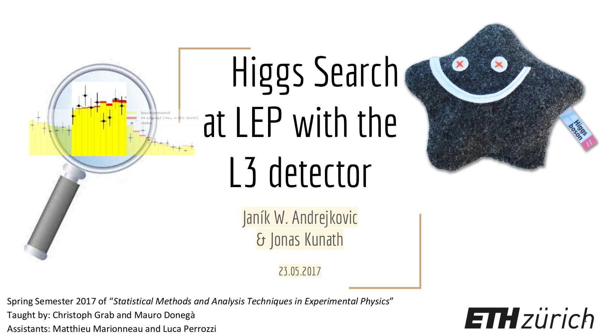

# Higgs-L3

  

A simple Higgs search study with public L3 data.

This code was originally created for the final project of the
[Statistical Methods and Analysis Techniques in Experimental Physics](http://www.vorlesungsverzeichnis.ethz.ch/Vorlesungsverzeichnis/lerneinheit.view?lerneinheitId=112378&semkez=2017S&lang=en) course at ETH Zurich in 2017.
The team members were [@jandrejk](https://github.com/jandrejk) and [@kunathj](https://github.com/kunathj).
The short [presentation](doc/Higgs_Search_at_LEP_with_the_L3_detector.pdf) should give an idea of what this project is all about.

## Deviation of the project from the report

Any additions to the code base after 2017 are not part of the course project.
If you are interested in the state of the project at hand-in time, go back to
that point in the git history.

While the style of the plots should remain the same,
the values are expected to change due to the estimator fine tuning.

## Setup

The necessary setup can be achieved with the provided [`setup.sh`](setup.sh) script.
This includes the download of the zipped data folder (~8 MB).

## Data source

This project is based on public data from the CERN LEP L3 experiment.

### The data location

Accompanying material and data is hosted on [OneDrive](https://1drv.ms/u/s!AkdwqUOfP6nWhI5GuknKTe0LlkgKvA?e=5pESGI).
Please raise an [issue](https://github.com/kunathj/Higgs-L3/issues) in case this link becomes stale.
